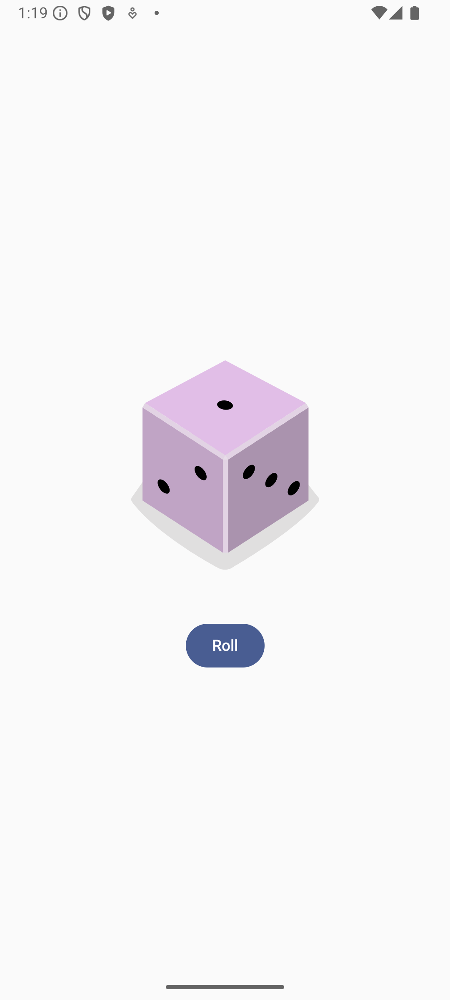

# Dice App 🎲

A simple Android app built using Jetpack Compose that simulates rolling a dice. This app demonstrates basic Compose UI elements, state management, and handling of button click events to simulate the randomness of dice rolls.


## Features

- 🎲 Random Dice Roll: Tap the "Roll" button to generate a random number between 1 and 6.
- 🖼️ Image Display: Displays an image corresponding to the dice number (1 to 6).
- 📱 Compose UI: Uses Jetpack Compose for the user interface with a clean and simple design.

## Preview




## Project Structure

- **MainActivity.kt**: This is the main entry point of the app, where the Compose content is set up.
- **Composable Functions**:
  - `DiceRollerApp()`: The main Composable that wraps the app layout and UI.
  - `DiceWithButtonAndImage()`: Contains the dice image and the button to roll the dice. Manages state for dice roll results.

## Code Overview

### MainActivity

The `MainActivity` class inherits from `ComponentActivity`. It sets up the Compose content and applies the app's theme using `DiceAppTheme`.

```kotlin
class MainActivity : ComponentActivity() {
    override fun onCreate(savedInstanceState: Bundle?) {
        super.onCreate(savedInstanceState)
        enableEdgeToEdge()
        setContent {
            DiceAppTheme {
                DiceRollerApp()
            }
        }
    }
}
```

### Composables

- `DiceRollerApp`: A simple previewable Composable that wraps the UI layout.

  ```kotlin
  @Preview
  @Composable
  fun DiceRollerApp() {
      DiceWithButtonAndImage(modifier = Modifier
          .fillMaxSize()
          .wrapContentSize(Alignment.Center)
      )
  }
  ```

- `DiceWithButtonAndImage`: This Composable function displays an image corresponding to the current dice result and a button to trigger a random dice roll.

  ```kotlin
  @Composable
  fun DiceWithButtonAndImage(modifier: Modifier = Modifier) {
      var result by remember { mutableStateOf(1) }

      val imageResource = when (result) {
          1 -> R.drawable.dice_1
          2 -> R.drawable.dice_2
          3 -> R.drawable.dice_3
          4 -> R.drawable.dice_4
          5 -> R.drawable.dice_5
          else -> R.drawable.dice_6
      }

      Column (
          modifier = modifier,
          horizontalAlignment = Alignment.CenterHorizontally
      ) {
          Image(
              painter = painterResource(imageResource),
              contentDescription = result.toString()
          )

          Spacer(modifier = Modifier.height(16.dp))

          Button(onClick = { result = (1..6).random() }) {
              Text(stringResource(R.string.roll))
          }
      }
  }
  ```

## Getting Started

### Prerequisites

- Android Studio
- Android SDK 21+
- Kotlin

### Steps to Run

#### Install & Run apk (method 1)

1. Just install `app.apk` and run it.

#### Clone & Run in Android Studio (method 2)

1. Clone the repository:
   ```bash
   git clone https://github.com/ShaidaMuhammad/Dice-Roller.git
   ```

2. Open the project in Android Studio.

3. Build and run the app on an emulator or a physical device.

## Dependencies

- Jetpack Compose
- Material3 Components

---

Made with ❤️ by Shaida Muhammad